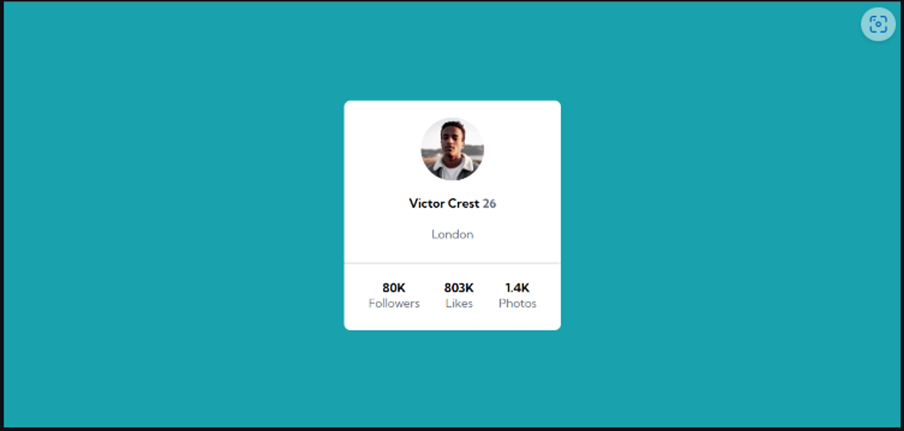

# Profile-Card- Ricardo Vitor
Primeiro projeto confeccionado através do Frontend Mentor, nível: Newbie, com a ajuda do curso do Dev-Quest. O mesmo consiste em um profile-card com a minha foto do instagram pessoal, que simula um layout parecido do card do instagram com número de seguidores, likes e fotos fictício.

## Tecnologias Utilizadas
- HTML
- CSS

## Layout esperado Desktop:
Um layout no formato de um desktop, retirado do exemplo do Frontend Mentor, com dados fictícios.

## Layout Esperado Mobie:
Um layout no formato de um dispositivo mobile, retirado do exemplo do Frontend Mentor, com dados fictícios.

## Serviços usados
- VSCode
- GitHub
- GitHub Pages

## Funcionalidades
A principal funcionalidade se baseia em exibir um perfil, pré-estabelecido no formato de um card que imita o layout do profle-card do instagram.

## Links
- GitPages: https://ricardovcastilho.github.io/Profile-card/
- Link do repositório: https://github.com/RicardoVCastilho/Profile-card

## Autor
Ricardo Vitor Castilho.
